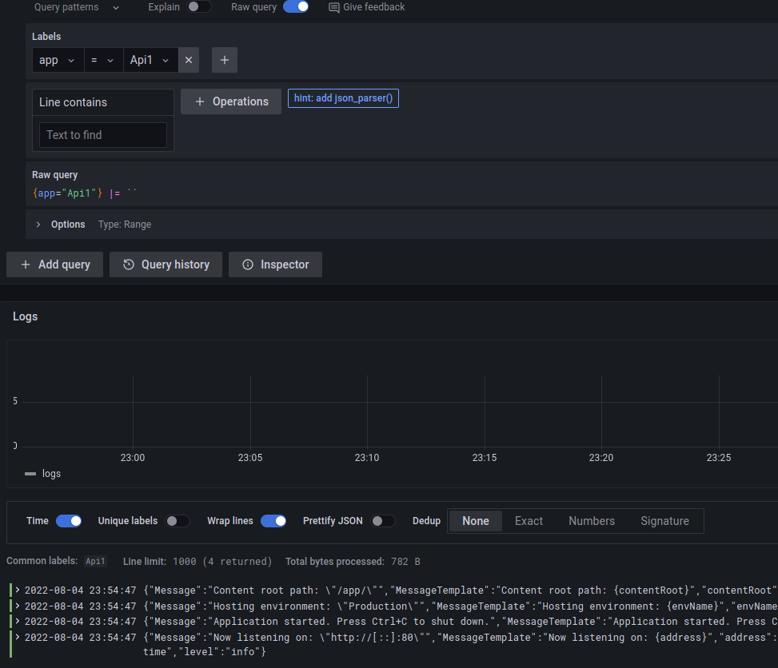
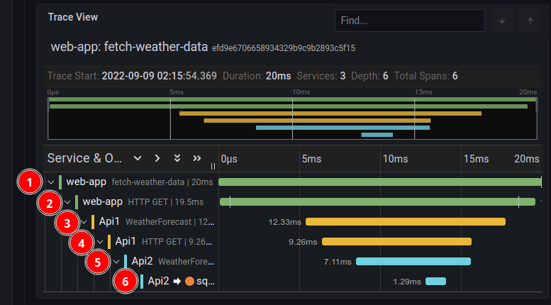

[toc]

# OpenTelemetry


## OpenTelemetry integration in .NET Projects

- Install nuget packages:

  - OpenTelemetry.Api
  - OpenTelemetry.Exporter.OpenTelemetryProtocol
  - OpenTelemetry.Extensions.Hosting
  - OpenTelemetry.Instrumentation.AspNetCore
  - OpenTelemetry.Instrumentation.Http
  - OpenTelemetry.Instrumentation.SqlClient

- Setup OpenTelemetry in `Program.cs`:

  ```cs
  builder.Services.AddOpenTelemetryTracing(b =>
  {
      b.AddOtlpExporter(options => options.Endpoint = new Uri("http://agent:4318/v1/traces"));
      
      // TODO: receive traces from our own custom sources
      //b.AddSource(TelemetryConstants.MyAppTraceSource);
      
      // decorate our service name so we can find it when we look inside Jaeger
      b.SetResourceBuilder(ResourceBuilder.CreateDefault()
          .AddService("Api1", "Demo"));
      
      // receive traces from built-in sources
      b.AddAspNetCoreInstrumentation();
      b.AddHttpClientInstrumentation();
      b.AddSqlClientInstrumentation();
  });
  ```

- 

## Serilog structured logging configuration for Loki

- install nuget packages:
  - Serilog.AspNetCore
  - Serilog.Sinks.Grafana.Loki

- add the following to `Program.cs`, just below the builder creation:
```cs
var logger = new LoggerConfiguration()
    .ReadFrom.Configuration(builder.Configuration)
    .Enrich.FromLogContext()
    .CreateLogger();
builder.Logging.ClearProviders();
builder.Logging.AddSerilog(logger);
```

- add these settings to appsettings.Development.json:
```json
  "Serilog": {
    "Using": [ "Serilog.Sinks.File"],
    "MinimumLevel": {
      "Default": "Information"
    },
    "WriteTo": [
      {
        "Name": "File",
        "Args": {
          "path": "/tmp/OpenTelemetryTest/api1-.log",
          "rollingInterval": "Day",
          "outputTemplate": "[{Timestamp:yyyy-MM-dd HH:mm:ss.fff zzz} {TraceId} {CorrelationId} {Level:u3}] {Message:lj}{NewLine}{Exception}"
        }
      },

      {
        "Name": "GrafanaLoki",
        "Args": {
          "uri": "http://loki:3100",
          "labels": [
            {
              "key": "app",
              "value": "Api1"
            }
          ],
          "propertiesAsLabels": [
            "app"
          ]
        }
      }      
    ],
    
  }
```

- test that we get logs in Grafana (filter by app label)
  Go to http://localhost:3000, log in as admin/admin and navigate to Explore -> Loki:
  
  
  
- enrich logging with TraceId and SpanId
  - install `Serilog.Enrichers.Span` nuget package
  - add `.Enrich.WithSpan()` to Serilog's `LoggerConfiguration` (Program.cs)


## Loki filtering

- Add Json filter
- Add line format: `[{{.level}}] {{.Message}}`


## Exporting metrics endpoints in .Net APIs

Packages:

- prometheus-net
- prometheus-net.AspNet


## Integration into Javascript applications

### NPM Packages used

``` json
    "@opentelemetry/api": "^1.2.0",
    "@opentelemetry/context-zone": "^1.6.0",
    "@opentelemetry/core": "^1.6.0",
    "@opentelemetry/exporter-trace-otlp-http": "^0.32.0",
    "@opentelemetry/instrumentation": "^0.32.0",
    "@opentelemetry/instrumentation-document-load": "^0.30.0",
    "@opentelemetry/instrumentation-fetch": "^0.32.0",
    "@opentelemetry/propagator-b3": "^1.6.0",
    "@opentelemetry/resources": "^1.6.0",
    "@opentelemetry/sdk-trace-base": "^1.6.0",
    "@opentelemetry/sdk-trace-web": "^1.6.0",
    "@opentelemetry/semantic-conventions": "^1.6.0"
```


### Registering instrumentation providers

- Summary of registering the instrumentation providers and the automatic instrumentation for API calls via `fetch`:
  ``` ts
  import { WebTracerProvider } from '@opentelemetry/sdk-trace-web';
  import { registerInstrumentations } from '@opentelemetry/instrumentation';
  import { FetchInstrumentation } from '@opentelemetry/instrumentation-fetch';
  import { ZoneContextManager } from '@opentelemetry/context-zone';
  import { SemanticResourceAttributes } from "@opentelemetry/semantic-conventions";
  import { Resource } from "@opentelemetry/resources";
  import { ConsoleSpanExporter, SimpleSpanProcessor } from "@opentelemetry/sdk-trace-base";
  import { OTLPTraceExporter } from "@opentelemetry/exporter-trace-otlp-http";
  import { TracingServiceName } from "../constants";
  import { W3CTraceContextPropagator } from "@opentelemetry/core";
  
  const resource = new Resource("My React App");
  const provider = new WebTracerProvider({resource});
  
  // add a console exporter (for debugging) and an OTLP exporter for sending traces to Grafana Tempo
  provider.addSpanProcessor(new SimpleSpanProcessor(new ConsoleSpanExporter()));
  provider.addSpanProcessor(new SimpleSpanProcessor(new OTLPTraceExporter({
      url: "http://agent-proxy:4418/v1/traces",
  })));
  
  // now register the provider
  provider.register({
      // Zone is required to keep async calls in the same trace
      contextManager: new ZoneContextManager(),  
      // this is used to propagate OpenTelemetry header (traceparent) to all downstream API calls 
      // Note: .Net Core uses W3C TraceContext headers by default for receiving 
      // and propagating OpenTelemetry context (i.e. traceparent header)
      propagator: new W3CTraceContextPropagator()
  });
  
  // this is needed to automatically instrument API calls via fetch()
  const fetchInstrumentation = new FetchInstrumentation({
      propagateTraceHeaderCorsUrls: [
          /.+/g,
       ],
      clearTimingResources: true,
  });
  fetchInstrumentation.setTracerProvider(provider);
  
  // Registering instrumentations
  registerInstrumentations({
      instrumentations: [
          fetchInstrumentation,
      ],
  });
  
  
  ```

- Note: in the above sample, the app sends instrumentation data to Grafana agent (which forwards it to Tempo for storage) via a Nginx reverse proxy in order to avoid CORS errors. See the section below on how to set up this proxy.

### Create a Nginx reverse proxy for talking to Grafana Agent

Nginx.conf:

``` nginx
server {
  listen        4418;
  server_name   localhost;


  location / {

    proxy_pass http://agent:4318;
    proxy_set_header HOST $host;
    proxy_set_header X-Real-IP $remote_addr;

    # Simple requests
    if ($request_method ~* "(GET|POST)") {
      add_header "Access-Control-Allow-Origin"  "http://localhost:8091";
      add_header "Access-Control-Allow-Credentials" "true";
    }

    # Preflighted requests
    if ($request_method = OPTIONS ) {
      add_header "Access-Control-Allow-Origin"  "http://localhost:8091";
      add_header "Access-Control-Allow-Methods" "GET, POST, OPTIONS, HEAD";
      add_header "Access-Control-Allow-Headers" "Authorization, Origin, X-Requested-With, Content-Type, Accept";
      add_header "Access-Control-Allow-Credentials" "true";
      return 200;
    }

  }
}

```

Note: `agent` in the above config file is the Docker container where Grafana agent is running (on http port 4318).

Dockerfile:

``` dockerfile
FROM nginx:alpine

WORKDIR /etc/nginx
COPY ./nginx.conf ./conf.d/default.conf
EXPOSE 4418
ENTRYPOINT [ "nginx" ]
CMD [ "-g", "daemon off;" ]
```


### Creating an Open Telemetry tracing span

Sample code for starting a span for instrumenting a particular user action:

``` tsx
import opentelemetry from '@opentelemetry/api';
import React, {useEffect} from 'react';

// this is a React component
const WeatherChart = () => {

	const [weatherDetails, setWeatherDetails] = React.useState<Array<WeatherForecast>>([]);
    const tracer = opentelemetry.trace.getTracer("My React App");

    // method used to retrieve data asynchronously from an external API
    const fetchWeatherData  = async () => {
        // this starts a new span, which will be propagated to all downstream API calls
        // (identified by a name - "fetch-weather-data")
        const rootSpan = tracer.startSpan("fetch-weather-data");
       
        await context.with(trace.setSpan(context.active(), rootSpan), async () => {
            // this calls an external API via fetch - this is instrumented automatically
            // note: multiple API calls that are part of the same user action could
            // be initiated under the same span
            const data = await getWeatherDetails();
            // add a custom event (optional)
            trace.getSpan(context.active()).addEvent('fetch-weather-data-completed');
            
            // save data to the state
            setWeatherDetails(data);
        });

        // finish the span
        rootSpan.end();
    }

    useEffect(() => {
        const data = fetchWeatherData()
            .catch(console.error);
    }, []);
    
    // actual rendering follows
    // ...
}

```


The above code will result in a trace that looks like this:



The above trace contains the following spans:

1. The root span we created manually above
2. The span for the first API call initiated from the web app via `fetch` (this is automatically instrumented)
3. The span instrumented from within the first API call itself - a .Net Web API  (`Api1`) - instrumented via .Net (automatically instrumented)
4. The span for the second API call initiated via `HttpClient` (automatically instrumented)
5. The span instrumented from within the second API call (`Api2`) (automatically instrumented)
6. The span for the MS SQL Server database lookup via `SqlClient` (automatically instrumented)

As can be seen above, all calls are automatically instrumented, with the exception of the initial root span, which needs to be put in place manually as it requires knowledge of the application’s functionality - i.e. knowing what constitutes user actions that need to be traced.